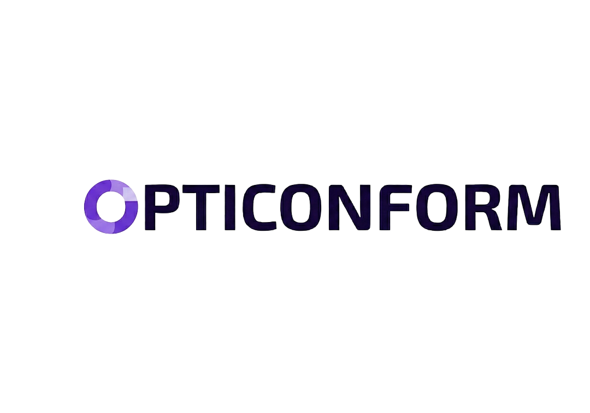

@section home "OPTICONFORM"
- group: Home

@whyWhatHow

- partner_logo: Omundu | data/logo-omundu.png | https://www.omundu.ai/
- partner_logo: LIRIS - CNRS | data/logo-liris.png | https://liris.cnrs.fr/
- partner_logo: Université Claude Bernard Lyon 1 | data/logo-ucbl1.svg | https://www.univ-lyon1.fr/
- partner_logo: Région Auvergne-Rhône-Alpes | data/logo-region-aura.jpg | https://www.auvergnerhonealpes.fr/

**why:** Face à la complexité croissante des équipements industriels et à la pénurie persistante de main-d'œuvre qualifiée, l'industrie doit simplifier et accélérer l'accès à une documentation technique exhaustive. Les opérateurs et techniciens ont besoin d'obtenir rapidement des réponses fiables, contextualisées et exploitables à partir de documents techniques souvent volumineux, hétérogènes et multimodaux.

**what:** OPTICONFORM explore des Small Language Models (SLMs) robustes, légers et fiables, capables d'intégrer efficacement des informations multimodales : textes, images, schémas et tableaux. L'objectif est de fournir, à partir d'une question ou d'une image, des réponses précises et contextualisées issues de documents techniques industriels.

**how:** Le projet combine des techniques avancées de compression de modèles, notamment la distillation et l'élagage, avec une calibration rigoureuse fondée sur la prédiction conforme. Cette approche permet d'associer à chaque prédiction un niveau de confiance explicite, afin d'aider les opérateurs industriels à prendre des décisions plus fiables. OPTICONFORM évalue aussi les limites de réduction des modèles et l'extension de leurs capacités à traiter des entrées visuelles avec un faible coût computationnel.
