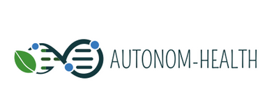

@section home "Theoretical Framework for Designing and Analyzing Resilient Smart Cyber Systems"
- group: Home

@whyWhatHow

**why:** The growing dependence of society on cyber systems in all areas (defense, economy, health, education) makes them prime targets for cyberattacks due to the profound and catastrophic damage such attacks could inflict on the economy and people's daily lives. It is widely recognized that cyber resources and services can be penetrated and maliciously exploited, and that attacks are becoming more potent and persistent. These challenges are keys for endowing software and hardware with intelligence (Software Intelligence).
